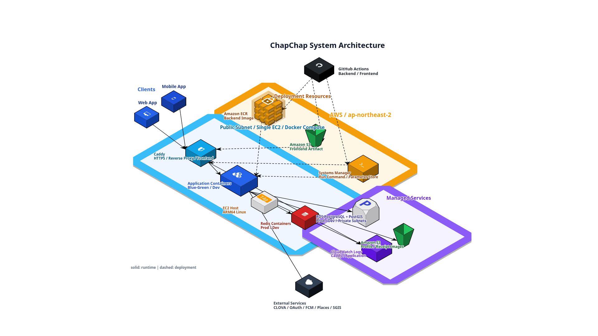
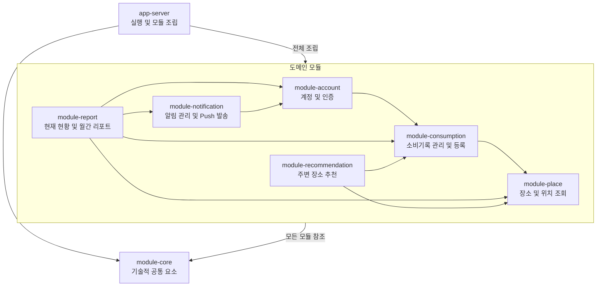

# ChapChap Backend

  

  <a href="https://chapchap.kr">Web</a> · iOS (준비 중)

## Overview

ChapChap은 일상의 소비를 기록하고, 방문한 동네와 장소를 돌아보며 반복되는 소비 속 나만의 취향을 발견하는 서비스입니다.

**ChapChap Backend**는 Web·App 클라이언트가 공통으로 사용하는 Spring Boot API 서버입니다.

Gradle Multi-Module 기반의 Modular Monolith 구조를 따르며, 
Domain-Driven Design 원칙에 따라 도메인 경계를 정의하고 각 모듈 내부에는 Clean Architecture를 적용했습니다.

[아키텍처와 설계 원칙](docs/architecture.md) · [Code·Git 컨벤션](docs/conventions.md)

## Features

| Domain | Features |
| --- | --- |
| 계정 | Web·iOS 공통 소셜 로그인(PKCE), 약관 동의, JWT 발급·재발급, 프로필·회원탈퇴 |
| 소비기록 | 날짜·시간·금액·카테고리·장소 기록, 방문 장소 조회, 스티커 획득 |
| 영수증 OCR | 영수증 이미지 인식, 매장명·주소·거래 일시·결제금액 초안 생성 |
| 장소 | Google Place ID 기반 중복 방지, 방문 장소 사진 조회, SGIS 행정동 변환, 장소 좋아요 |
| 추천 | 지도 중심 좌표 주변의 미방문 인기 장소와 최근 30일 선호 카테고리 장소 추천 |
| 리포트 | 현재 소비 현황과 월간 통계·소비 페르소나 제공 |
| 알림 | 알림 목록·읽음 처리, 월간 리포트 완료 및 금요일 소비 기록 리마인드 FCM 푸시 |

## Tech Stack

| Area | Technologies |
| --- | --- |
| **Core Stack** |    |
| **Web & API** |      |
| **Security** |     |
| **Data** |     |
| **Geospatial** |    |
| **Cache & Rate Limiting** |   |
| **Integrations** |     |
| **Infrastructure** |        |
| **Deployment** |     |
| **Observability** |    |
| **Testing** |     |

## Architecture

### System Architecture

AWS 인프라는 Terraform으로 관리하며, 하나의 Application EC2에서 Production과 Development의 애플리케이션·Redis 컨테이너를 분리해 운영합니다. 
Caddy는 `/api`와 `/dev/api` 요청을 각 환경으로 라우팅하고, Production은 Blue/Green, Development는 단일 컨테이너 교체 방식으로 배포합니다. 
RDS는 Private Subnet에 배치하고 데이터베이스와 S3 버킷은 환경별로 분리하며, 로그는 CloudWatch에 수집합니다.

  

### Multi-Module Architecture

ChapChap은 하나의 애플리케이션으로 배포하는 Modular Monolith입니다. 도메인마다 Gradle 모듈을 분리하고, `app-server`가 실행 시점에 모듈을 조립합니다.

| Module | Responsibility |
| --- | --- |
| `app-server` | Spring Boot 실행, 전역 Web·Security·Scheduling 설정, 도메인 모듈 조립 |
| `module-account` | 계정·소셜 로그인·토큰 발급 및 사용자 상태 관리 |
| `module-consumption` | 소비기록 관리와 수기·영수증 OCR 기반 등록 |
| `module-place` | 장소·좋아요 관리, 위치 기반 조회와 외부 장소 정보 연동 |
| `module-recommendation` | 방문 이력·선호 카테고리를 조합한 주변 장소 추천 |
| `module-report` | 현재 소비 현황과 월간 소비 리포트 생성·조회 |
| `module-notification` | 알림 조회·읽음 처리와 FCM 푸시 발송 |
| `module-core` | 공통 API 응답·예외·인증 애노테이션, JPA 공통 요소와 테스트 Fixture |

도메인 모듈은 `api → application → domain`, `infra → application/domain` 방향을 따릅니다. 
다른 도메인의 Entity나 Repository를 직접 사용하지 않고, 필요한 모듈의 공개 Application API와 DTO를 통해 연동합니다. 
이 규칙은 ArchUnit 테스트로 검증합니다.

## Team

<table align="center">
  <tr>
    <td align="center" width="220">
      <a href="https://github.com/dhgudtmxhs">
         
        <strong>오형석</strong>
      </a> 
      @dhgudtmxhs
    </td>
    <td align="center" width="220">
      <a href="https://github.com/p0o0y">
         
        <strong>박가영</strong>
      </a> 
      @p0o0y
    </td>
  </tr>
</table>
