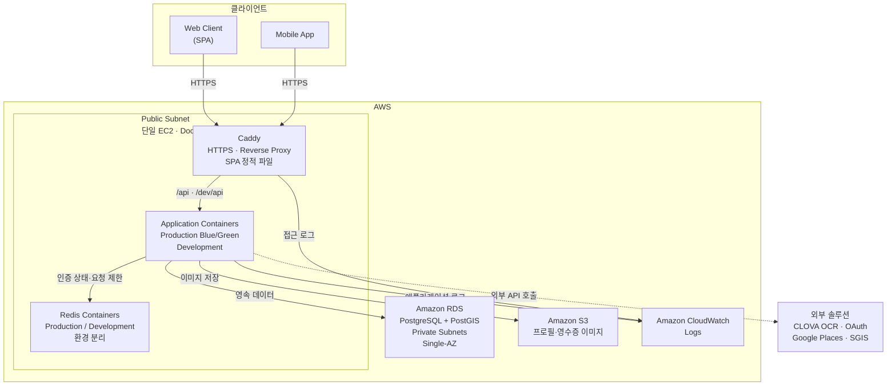
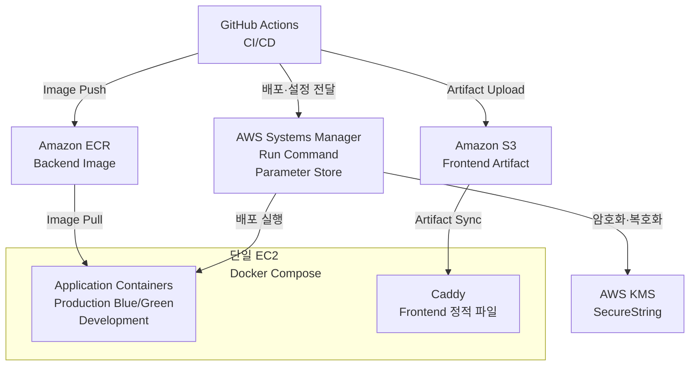
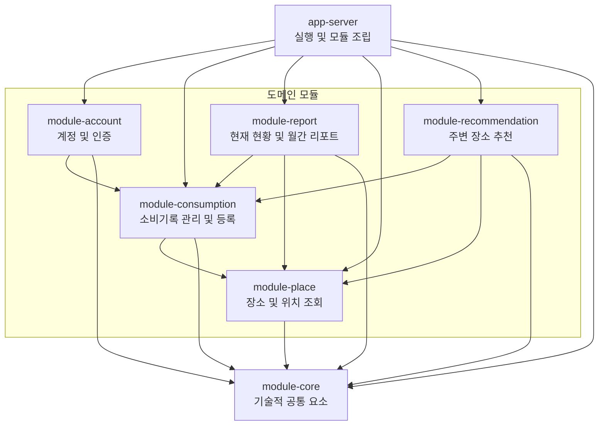
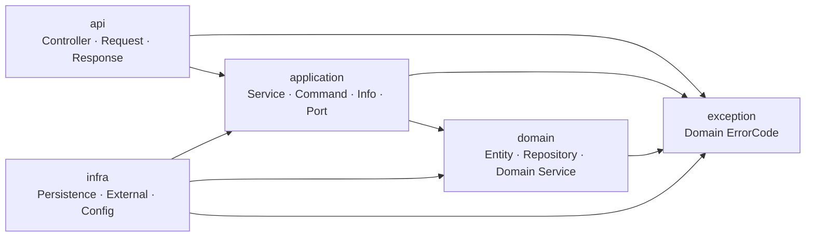

# 아키텍처

## 🧰 1. 기술 스택 및 구성 요소

### 1.1 백엔드 개발 환경

| 항목 | 기술 | 버전 |
| --- | --- | --- |
| Language | Java | 21 (LTS) |
| Framework | Spring Boot | 3.5.16 |
| Build Tool | Gradle | 8.14.3 |
| API | REST API | — |
| API Documentation | springdoc-openapi + Swagger UI | 2.8.17 |
| Validation | Jakarta Bean Validation | Spring Boot BOM |
| Social Authentication | Kakao OAuth 2.0 / Google OpenID Connect | — |
| API Authentication | Spring Security OAuth 2.0 Resource Server | Spring Boot BOM |
| Authorization Token | JWT | — |
| External API Client | Spring RestClient | Spring Boot BOM |
| Persistence | Spring Data JPA | Spring Boot BOM |
| Query Builder | QueryDSL | Spring Boot BOM |
| Database Migration | Flyway | Spring Boot BOM |
| Object Storage Client | AWS SDK for Java 2.x (S3) | 2.49.6 |
| Logging | SLF4J, Logback | Spring Boot BOM |
| Test | JUnit 5, Mockito | Spring Boot BOM |
| Integration Test | Testcontainers | Spring Boot BOM |
| Monitoring | Spring Boot Actuator | Spring Boot BOM |

### 1.2 데이터 저장소

| 항목 | 기술 | 버전 |
| --- | --- | --- |
| RDBMS | PostgreSQL | 17 |
| GIS Extension | PostGIS | 3.5 |
| Key-Value Store | Redis | 7.4 |

- Redis는 Refresh Token의 유효 상태, OAuth 인증 과정의 일회성 상태, CLOVA OCR 요청 간격 및 Google Places Photo Media의 월간 호출 횟수를 저장한다.
- SGIS Access Token은 만료 시각과 함께 애플리케이션 메모리에 캐시한다.

### 1.3 외부 솔루션 연동

| 항목 | 기술 | 버전 |
| --- | --- | --- |
| OCR | NAVER CLOVA OCR General | — |
| Place Details / Photo | Google Places API (New) | v1 |
| Address Geocoding | SGIS OpenAPI | OpenAPI3 |
| Social Login Provider | Kakao OAuth 2.0 / Google OpenID Connect | — |

- CLOVA OCR General이 인식한 텍스트를 애플리케이션에서 파싱해 영수증의 상호명, 주소, 일시와 금액을 추출한다.
- Google Places API는 장소 사진 조회에, SGIS OpenAPI는 도로명주소의 행정동 변환에 사용한다.

### 1.4 인프라 및 배포

| 항목 | 기술 | 버전 |
| --- | --- | --- |
| Cloud Platform | AWS | — |
| Network | Amazon VPC | — |
| Compute | Amazon EC2 | — |
| Database Service | AWS RDS for PostgreSQL | — |
| Container Registry | Amazon ECR | — |
| Object Storage | AWS S3 | — |
| Remote Deployment / Configuration | AWS Systems Manager Run Command / Parameter Store | — |
| Secrets Encryption | AWS KMS | — |
| Reverse Proxy / Static File Server | Caddy | 2 |
| Container | Docker | — |
| Container Composition | Docker Compose | — |
| Infrastructure as Code | Terraform | — |
| CI/CD | GitHub Actions | — |
| Deployment Strategy | Production Blue/Green / Development Single Container Replacement | — |
| Health Check | Spring Boot Actuator | — |
| Centralized Logging | Amazon CloudWatch Logs | — |
| TLS / HTTPS | Caddy Automatic HTTPS | — |

### 🗺️ 2. 시스템 아키텍처

#### 2.1 시스템 구성도

##### 서비스 구성



##### 배포 흐름




#### 2.2 인프라 및 배포

**인프라**

- Terraform으로 서울 리전의 VPC, EC2, RDS, ECR, S3, CloudWatch Logs, IAM/OIDC와 KMS를 관리한다. Terraform 상태는 암호화된 S3 Backend에 저장한다.
- 단일 EC2에서 Caddy, Production Blue/Green 애플리케이션, Development 애플리케이션과 환경별 Redis를 Docker Compose로 운영한다.
- RDS는 2개 AZ의 Private Subnet으로 구성한 DB Subnet Group에 배치하되 Single-AZ로 운영한다. ALB와 NAT Gateway는 사용하지 않는다.
- 프로필·영수증 이미지는 환경별 S3 버킷에 저장하며, Frontend 배포 산출물도 비공개 S3 버킷을 거쳐 EC2로 동기화한다.

**CI/CD 및 배포**

- develop 브랜치의 Pull Request와 Push는 GitHub Actions에서 전체 빌드와 테스트를 수행한다.
- 배포 시 GitHub Actions는 OIDC로 AWS 임시 자격증명을 발급받아 ARM64 이미지를 ECR에 Push하고, Systems Manager Run Command로 EC2의 배포 스크립트를 실행한다.
- 환경 설정은 KMS로 암호화한 Parameter Store SecureString으로 전달한다.

| 환경 | 배포 조건                 | 배포 방식 |
| --- |-----------------------| --- |
| Development | `develop` Push의 CI 성공 | 단일 Container 교체 |
| Production | `main` Push           | Blue/Green 전환 |

- Production은 새 Container의 Actuator Health Check가 통과하면 Caddy Upstream을 전환하고 기존 Container를 중지한다.

**트래픽 및 로그**

- Caddy는 SPA 정적 파일을 제공하고 `/api`와 `/dev/api`를 각 환경의 애플리케이션으로 전달하며 HTTPS를 처리한다.
- Caddy와 애플리케이션 로그는 Docker `awslogs` 드라이버를 통해 CloudWatch Logs로 전송한다.

### 🧱 3. 애플리케이션 아키텍처 및 설계 원칙

#### 3.1 아키텍처 개요

| 구분 | 역할 | 적용 방식 |
| --- | --- | --- |
| Modular Monolith | 애플리케이션 전체 구조 | 하나의 애플리케이션 안에서 도메인별로 모듈을 분리한다. |
| Domain-Driven Design | 도메인과 모듈의 경계 설정 | 비즈니스 책임을 기준으로 각 도메인의 역할과 경계를 정한다. |
| Clean Architecture | 모듈 내부 구조 | 계층별 책임을 나누고 의존성이 Domain을 향하도록 구성한다. |
| Gradle Multi-Module | 모듈의 물리적 분리 | 모듈별 Build 단위를 나누고 의존 관계를 명시적으로 관리한다. |

#### 3.2 멀티모듈 구성 및 의존관계

**3.2.1 모듈 구성**

| 모듈 | 주요 책임                                       |
| --- |---------------------------------------------|
| app-server | Spring Boot 실행, 모듈 조립, Security 및 공통 Web 설정 |
| module-account | 계정, 회원가입, 소셜 로그인, 토큰 발급 및 사용자 상태 관리         |
| module-consumption | 소비기록 관리와 수기·영수증 OCR 기반 등록                   |
| module-report | 현재 월 누적·주별 현황과 월간 소비 리포트 생성 및 조회            |
| module-place | 장소·좋아요 관리, 위치 기반 조회, 장소 사진 및 행정동 연동         |
| module-recommendation | 위치·방문 이력·최근 30일 주요 소비 카테고리를 조합한 주변 장소 추천             |
| module-core | 공통 응답·예외 처리, `@ChapChapUserId`, JPA 공통 엔티티, Flyway 및 Testcontainers 설정 |

**3.2.2 모듈 의존 관계**



**3.2.3 모듈 의존성 원칙**

- 화살표는 Gradle 모듈 의존성과 코드의 참조 방향을 나타낸다.
- app-server는 도메인 모듈을 조립하고 전역 Web·Security 설정을 담당한다. 비즈니스 로직은 각 도메인 모듈에 둔다.
- 도메인 모듈은 app-server를 참조하지 않는다.
- 도메인 모듈 간 의존성은 필요한 경우에만 단방향으로 추가한다.
- 다른 모듈의 Entity와 Repository를 직접 참조하지 않고, 공개된 Application API를 사용한다.
- module-core에는 특정 도메인의 Port, DTO 또는 비즈니스 규칙을 두지 않는다.
- 양방향 의존성이 생기면 module-core로 우회하지 않고 도메인 책임과 의존 방향을 다시 조정한다.

#### 3.3 모듈 내부 Clean Architecture

**3.3.1 계층 구성**

| 계층 | 주요 책임 |
| --- | --- |
| api | Controller, HTTP 요청 검증, Request 및 Response 변환 |
| application | 유스케이스 실행, 트랜잭션 관리, 도메인 로직 조합 및 외부 연동 Port 정의 |
| domain | Entity, Domain Service 및 핵심 비즈니스 규칙 |
| infra | JPA·QueryDSL·Redis 기반 저장소 구현, S3·외부 API 연동 및 다른 모듈 Application API 연결 |

> Clean Architecture에서는 도메인 모델이 영속성 기술에 의존하지 않도록 설계하는 것을 지향한다.
다만 도메인 엔티티와 영속성 엔티티를 분리하면 영속성 컨텍스트 관리와 상태 동기화가 복잡해질 수 있으므로,
현재는 실용적인 관점에서 도메인 엔티티를 JPA 엔티티로도 사용한다.
>


**3.3.2 패키지 구조**

```text
module-{domain}
└── src/main/java
    └── kr.chapchap.{domain}
        ├── api
        │   ├── controller
        │   ├── request
        │   └── response
        │
        ├── application
        │   ├── service
        │   ├── command
        │   ├── info
        │   ├── port
        │   └── event
        │
        ├── domain
        │   ├── entity
        │   ├── repository
        │   └── service
        │
        ├── infra
        │   ├── persistence
        │   ├── external
        │   ├── config
        │   ├── event
        │   ├── scheduler
        │   └── security
        │
        └── exception
```

- 각 모듈별로 필요한 패키지만 사용한다.
- request와 response는 API 계층에서 사용하는 HTTP 입출력 객체다.
- command와 info는 Application 계층의 입출력 객체로, command는 유스케이스 입력을, info는 실행 결과를 전달한다.
- port는 외부 기능이나 다른 모듈을 사용하기 위해 Application 계층에서 정의하는 인터페이스다.
- domain/entity에는 JPA Entity와 상태 변경을 포함한 핵심 비즈니스 규칙을 둔다.
- domain/service에는 특정 Entity 하나에 두기 어려운 비즈니스 규칙을 둔다.
- domain/repository에는 저장소 인터페이스를, infra/persistence에는 JPA·QueryDSL 기반 구현체를 둔다.
- infra/external에는 외부 서비스 연동과 다른 모듈의 Application API를 연결하는 Adapter를 둔다.
- infra/config, infra/event, infra/scheduler, infra/security에는 각각 인프라 설정, 이벤트 처리, 배치 실행, 인증 구현을 둔다.
- exception에는 해당 모듈에서 사용하는 ErrorCode를 둔다.

```
각 도메인 모듈은 module- 접두사를 제외한 도메인명을 기본 패키지로 사용한다.
module-account → kr.chapchap.account
module-consumption → kr.chapchap.consumption
module-report → kr.chapchap.report
module-place → kr.chapchap.place
module-recommendation → kr.chapchap.recommendation
```

**3.3.3 계층 의존 관계**



- 화살표는 코드의 의존 방향을 의미한다.
- API 계층은 Application 계층과 Exception 계층을 참조한다.
- Application 계층은 같은 모듈의 Domain·Exception 계층과 다른 모듈의 공개된 Application API를 참조할 수 있다.
- Infra 계층은 Application 계층의 Port와 Domain 계층의 Repository 인터페이스를 구현하고 Exception 계층을 참조한다.
- Exception 계층은 모듈 내 여러 계층에서 사용하는 도메인별 ErrorCode를 제공한다.
- Domain 계층은 API, Application, Infra 계층을 참조하지 않는다.
- Application 계층은 Infra 계층의 구체적인 구현체를 직접 참조하지 않는다.

```
외부 연동이 포함된 유스케이스는 다음과 같이 실행된다.

Controller
    → Application Service
        → Application Port
            → Infra 구현체
                → 외부 솔루션

- 다른 모듈의 기능은 Application Service에서 직접 사용하거나 Infra Adapter를 통해 연결하며, 대상 모듈의 공개된 Application API만 참조한다.
```

**3.3.4 Application Service 구성 원칙**

- 단순한 상태 변경과 조회는 각각 CommandService와 QueryService로 구분한다.
- 소셜 로그인, OCR 처리, 장소 확인, 월간 리포트 집계처럼 흐름이 독립적인 기능은 책임이 드러나는 전용 Service로 분리한다.
- Command와 Query는 상태 변경 여부를 기준으로 구분하며, Port 사용 여부와는 관계없다.
- Application Service는 Repository, Domain 객체와 Port를 조합해 유스케이스를 실행하고 트랜잭션을 관리한다.
- Application Command의 값은 Application Service에서 꺼내 Entity나 Domain Service에 전달한다.
- Entity의 상태는 Entity 메서드를 통해 변경한다.
- 단순한 저장과 조회에는 Domain Repository를 직접 사용할 수 있다.
- Domain Service에는 특정 Entity 하나에 두기 어려운 비즈니스 규칙을 둔다.

#### 3.4 Domain-Driven Design

**3.4.1 DDD 적용 원칙**

- Account, Consumption, Report, Place, Recommendation을 각각 도메인 모듈로 구분한다.
- 각 모듈은 자신의 도메인 모델을 관리하며, 영속 데이터가 있는 경우 해당 데이터를 직접 소유한다.
- 다른 모듈의 Entity와 Repository를 직접 참조하지 않는다.
- 모듈 간 연동에는 식별자와 공개된 Application API를 사용한다.
- 상태 변경과 핵심 비즈니스 규칙은 Entity와 Domain Service에 둔다.
- 독자적인 영속 모델이 없는 조회·조합 기능은 Application Service에서 처리할 수 있다.
- 구조를 맞추기 위해 모든 모듈에 Aggregate나 Value Object를 일괄적으로 만들지 않는다.

**3.4.2 Bounded Context**

| Bounded Context | 담당 모듈 | 주요 책임 | 소유 데이터 |
| --- | --- | --- | --- |
| Account Context | module-account | 회원가입, 소셜 로그인, 계정 및 약관 동의 관리 | User, SocialAccount, UserTermsAgreement |
| Consumption Context | module-consumption | 소비기록 관리와 수기·영수증 OCR 기반 등록 | Consumption, ReceiptImage, StickerItem |
| Report Context | module-report | 현재 월 현황과 월간 소비 리포트 생성 및 조회 | Report와 카테고리·지역·장소·시간대별 집계 데이터 |
| Place Context | module-place | 장소·좋아요 관리, 위치 기반 조회, 장소 사진 및 행정동 변환 | Place, PlaceLike |
| Recommendation Context | module-recommendation | 위치·방문 이력·최근 30일 주요 소비 카테고리 기반 주변 장소 추천 | 없음 |

- Consumption Context는 사용자와 장소를 각각 userId와 placeId로 참조하며, User와 Place Entity를 직접 참조하지 않는다.
- Recommendation Context는 별도의 데이터를 저장하지 않고 Consumption과 Place 모듈에서 조회한 정보를 조합한다.
- OCR 결과는 소비기록 생성을 위한 자료로 사용하며 별도의 도메인으로 분리하지 않는다.
- CLOVA OCR, S3, 소셜 로그인 제공자, Google Places와 SGIS는 각 모듈의 Infra 계층에서 연동한다.
