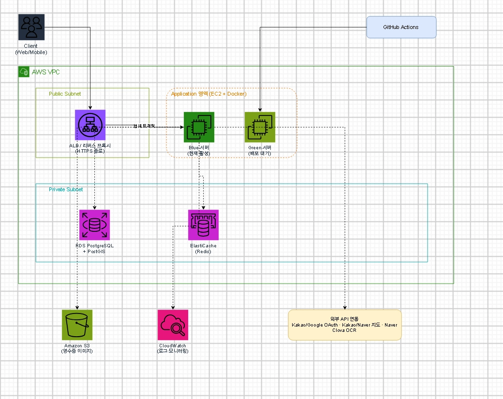
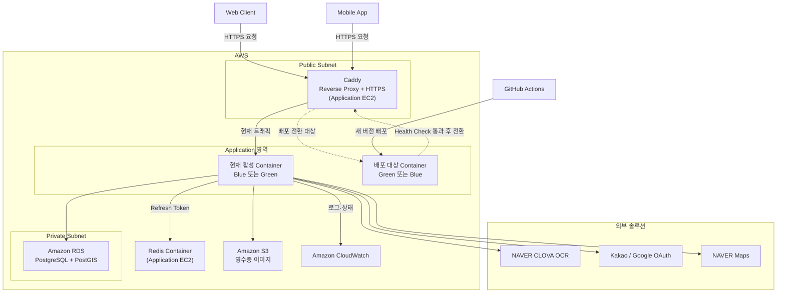
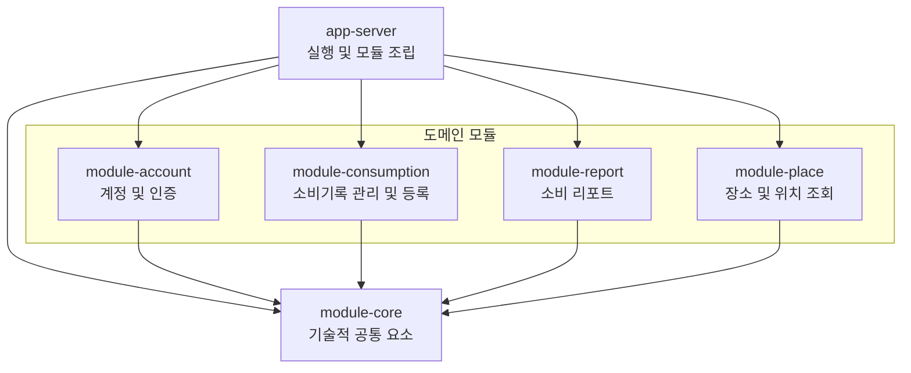
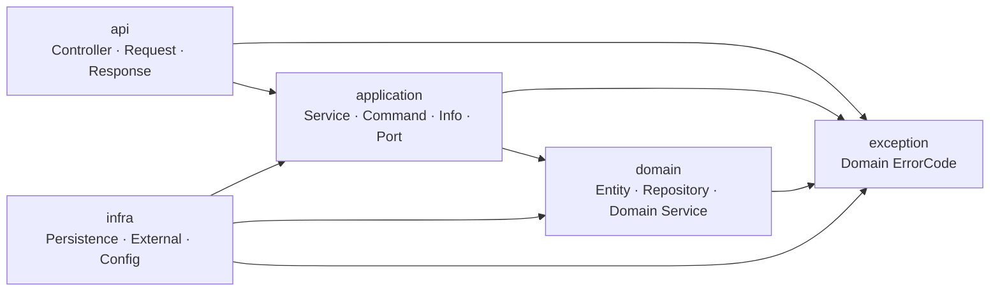

# 아키텍처

## 🧰 1. 기술 스택 및 구성 요소

### 1.1 백엔드 개발 환경

| 항목 | 기술 | 버전 |
| --- | --- | --- |
| Language | Java | 21 (LTS) |
| Framework | Spring Boot | 3.5.16 |
| Build Tool | Gradle | 8.14.3 |
| API | REST API | — |
| API Documentation | springdoc-openapi + Swagger UI | — |
| Validation | Jakarta Bean Validation | Spring Boot BOM |
| Social Authentication | Kakao OAuth 2.0 / Google OpenID Connect | — |
| API Authentication | Spring Security OAuth 2.0 Resource Server | Spring Boot BOM |
| Authorization Token | JWT | — |
| External API Client | Spring RestClient | Spring Boot BOM |
| Persistence | Spring Data JPA | Spring Boot BOM |
| Query Builder | QueryDSL | Boot 3.x 호환 버전 |
| Database Migration | Flyway | Spring Boot BOM |
| Logging | SLF4J, Logback | Spring Boot BOM |
| Test | JUnit 5, Mockito | Spring Boot BOM |
| Integration Test | Testcontainers | Spring Boot BOM |
| Monitoring | Spring Boot Actuator | Spring Boot BOM |

### 1.2 데이터베이스 및 캐시

| 항목 | 기술 | 버전 |
| --- | --- | --- |
| RDBMS | PostgreSQL | — |
| GIS Extension | PostGIS | — |
| Cache Abstraction | Spring Cache | Spring Boot BOM |
| Local Cache | Caffeine | Spring Boot BOM |
| Distributed Cache | Redis | — |

### 1.3 외부 솔루션 연동

| 항목 | 기술 | 버전 |
| --- | --- | --- |
| OCR | NAVER CLOVA OCR General | — |
| Receipt OCR | NAVER CLOVA OCR Receipt | — |
| Map | NAVER Maps | — |
| Social Login Provider | Kakao OAuth 2.0 / Google OAuth 2.0 | — |

### 1.4 인프라 및 배포

| 항목 | 기술 | 버전 |
| --- | --- | --- |
| Cloud Platform | AWS | — |
| Network | Amazon VPC | — |
| Compute | Amazon EC2 | — |
| Database Service | AWS RDS for PostgreSQL | — |
| Object Storage | AWS S3 | — |
| Reverse Proxy | Caddy | — |
| Container | Docker | — |
| Infrastructure as Code | Terraform | — |
| CI/CD | GitHub Actions | — |
| Deployment Strategy | Blue/Green Deployment | — |
| Monitoring | Amazon CloudWatch | — |
| TLS Certificate | Let’s Encrypt | — |

### 🗺️ 2. 시스템 아키텍처

#### 2.1 시스템 구성도





#### 2.2 인프라 구성 및 배포 방식

- 초기에는 Public Subnet의 단일 EC2에서 Caddy와 Blue/Green Docker Container를 운영한다.
- RDS는 Private Subnet에 배치하고, Security Group으로 애플리케이션 EC2의 접근만 허용한다.
- 영수증 이미지는 S3에 저장하고, 로그와 서버 상태는 CloudWatch를 통해 확인한다.
- GitHub Actions가 대기 Container에 신버전을 배포해 HealthCheck 후 Caddy가 트래픽을 전환한다.
- 초기에는 비용을 고려해 ALB와 NAT Gateway를 제외하고, 운영 규모에 따라 도입 여부를 재검토한다.
- Redis는 초기에는 EC2 내부 Container로 운영하고 필요 시 ElastiCache로 분리하는 방향을 검토한다.
- AWS 리소스의 생성과 변경 관리를 위해 Terraform 도입을 고려한다.

### 🧱 3. 애플리케이션 아키텍처 및 설계 원칙

#### 3.1 아키텍처 개요

| 구분 | 역할 | 적용 방식 |
| --- | --- | --- |
| Modular Monolith | 애플리케이션 전체 구조 | 하나의 애플리케이션 안에서 도메인별로 모듈을 분리한다. |
| Domain-Driven Design | 도메인과 모듈의 경계 설정 | 비즈니스 책임을 기준으로 각 도메인의 역할과 경계를 정한다. |
| Clean Architecture | 모듈 내부 구조 | 계층별 책임을 나누고 의존성이 Domain을 향하도록 구성한다. |
| Gradle Multi-Module | 모듈의 물리적 분리 | 모듈별 Build 단위를 나누고 의존 관계를 명시적으로 관리한다. |

#### 3.2 멀티모듈 구성 및 의존관계

**3.2.1 모듈구성**

| 모듈 | 주요 책임 |
| --- | --- |
| app-server | Spring Boot 실행, 모듈 조립, Security 및 공통 Web 설정 |
| module-account | 계정, 회원가입, 소셜 로그인, 토큰 발급 및 사용자 상태 관리 |
| module-consumption | 소비기록 관리와 수기·영수증 OCR 기반 등록 |
| module-report | 주간·월간 소비 리포트 생성 및 조회 |
| module-place | 장소 정보와 위치 기반 조회 |
| module-core | 공통 응답과 공통 예외 등 기술적 공통 요소 |

**3.2.2 모듈 의존 관계**



**3.2.3 모듈 의존성 원칙**

- 화살표는 Gradle 모듈 의존성을 의미하며, 화살표는 모듈의 참조 방향을 의미한다.
- app-server는 전체 도메인 모듈을 조립하며 비즈니스 로직을 직접 구현하지 않는다.
- 도메인 모듈은 app-server를 참조하지 않는다.
- 도메인 모듈 간 의존성이 필요한 경우 최소한의 단방향 의존성만 허용한다.
- 다른 모듈의 Entity와 Repository를 직접 참조하지 않고, 공개된 Application API와 DTO를 통해 통신한다.
- module-core에는 특정 도메인에 종속된 Port나 DTO를 배치하지 않는다.
- 양방향 의존이 발생하면 공통 모듈을 통해 우회하지 않고, 도메인 책임을 재조정하거나 별도의 모듈로 분리한다.

#### 3.3 모듈 내부 Clean Architecture

**3.3.1 계층 구성**

| 계층 | 주요 책임 |
| --- | --- |
| api | Controller, HTTP 요청 검증, Request 및 Response 변환 |
| application | 유스케이스 실행, 트랜잭션 관리, 도메인 로직 조합 및 외부 연동 Port 정의 |
| domain | Domain Entity, Domain Service 및 핵심 비즈니스 규칙 |
| infra | JPA 저장소 구현, QueryDSL, Redis, S3, OCR 및 외부 API 연동 구현 |

> Clean Architecture에서는 도메인 모델이 영속성 기술에 의존하지 않도록 설계하는 것을 지향한다.
다만 도메인 엔티티와 영속성 엔티티를 분리하면 영속성 컨텍스트 관리와 상태 동기화가 복잡해질 수 있으므로,
현재는 실용적인 관점에서 도메인 엔티티를 JPA 엔티티로도 사용한다.
>

**3.3.2 패키지 구조**

```
module-{domain}
└── src/main/java
    └── kr.chapchap.{domain}
        ├── api
        │   ├── controller
        │   ├── request
        │   └── response
        │
        ├── application
        │   ├── service
        │   ├── command
        │   ├── info
        │   └── port
        │
        ├── domain
        │   ├── entity
        │   ├── repository
        │   └── service
        │
        ├── infra
        │   ├── persistence
        │   ├── external
        │   └── config
        │
        └── exception
```

- request와 response는 API 계층에서 사용하는 HTTP 입출력 객체다.
- command와 info는 Application 계층의 입출력 객체로 command는 유스케이스 입력, info는 실행 결과를 전달한다.
- port는 외부 기능에 대해 Application 계층이 요구하는 인터페이스다.
- domain/entity에는 JPA Entity와 핵심 비즈니스 규칙을 배치한다.
- domain/repository에는 Domain Entity의 저장과 조회를 위한 인터페이스를 배치한다.
- domain/service에는 특정 Entity에 두기 어려운 비즈니스 규칙을 배치한다.
- infra/persistence에는 JPA와 QueryDSL 기반 저장소 구현을 배치한다.
- infra/external에는 외부 API, Object Storage 및 캐시 연동 구현을 배치한다.
- infra/config에는 해당 도메인 모듈의 인프라 설정을 배치한다.
- exception에는 해당 모듈의 모든 계층에서 공유하는 도메인별 ErrorCode를 배치한다.

```
각 도메인 모듈은 module- 접두사를 제외한 도메인명을 기본 패키지로 사용한다.
module-account → kr.chapchap.account
module-consumption → kr.chapchap.consumption
module-report → kr.chapchap.report
module-place → kr.chapchap.place
```

**3.3.3 계층 의존 관계**



- 화살표는 코드의 의존 방향을 의미한다.
- API 계층은 Application 계층과 Exception 계층을 참조한다.
- Application 계층은 Domain 계층과 Exception 계층을 참조한다.
- Infra 계층은 Application 계층의 Port와 Domain 계층의 Repository 인터페이스를 구현하고 Exception 계층을 참조한다.
- Exception 계층은 모듈 내 모든 계층에서 사용하는 도메인별 ErrorCode를 제공한다.
- Domain 계층은 Exception 계층만 참조할 수 있으며 API, Application, Infra 계층을 참조하지 않는다.
- Application 계층은 Infra 계층의 구체적인 구현체를 직접 참조하지 않는다.

```
외부 연동이 포함된 유스케이스는 다음과 같이 실행된다.
Controller
    → Application Service
        → Application Port
            → Infra 구현체
                → 외부 솔루션
```

**3.3.4 Application Service 구성 원칙**

- Application Service는 상태 변경을 담당하는 CommandService와 조회를 담당하는 QueryService로 구분하는 것을 기본으로 한다.
- CommandService는 생성·수정·삭제, QueryService는 조회를 담당한다.
- 각 Service에는 단순 처리와 여러 Domain 객체 및 Port를 조합하는 유스케이스 메서드를 함께 둘 수 있다.
- Service가 커지거나 유스케이스 흐름이 복잡해지면 해당 유스케이스를 담당하는 전용 Application Service로 분리한다.
- CommandService도 외부 연동이 필요하면 Application Port를 사용할 수 있다.
- Port 사용 여부는 Command와 Query의 구분 기준이 아니다.
- Application Command는 Domain 계층에 직접 전달하지 않는다.
- Application Service가 필요한 값을 꺼내 Domain Entity, Value Object 또는 Domain Service에 전달한다.
- Application Service는 단순 저장·조회에 Domain Repository를 직접 사용할 수 있다.
- Entity의 상태 변경은 Entity 메서드를 통해 수행한다.
- Domain Service는 Entity나 Value Object에 두기 어려운 도메인 규칙을 담당한다.

#### **3.4 Domain-Driven Design**

**3.4.1 DDD 적용 원칙**

- 비즈니스 책임과 사용하는 언어가 달라지는 지점을 기준으로 Bounded Context를 구분한다.
- 각 Bounded Context는 하나의 도메인 모듈과 대응하는 것을 기본 원칙으로 한다.
- 각 모듈은 자신의 도메인 모델과 데이터에 대한 소유권을 가진다.
- 다른 모듈의 Entity와 Repository를 직접 참조하지 않는다.
- 모듈 간에는 식별자와 공개된 Application API 및 DTO만 전달한다.
- 핵심 비즈니스 규칙은 Controller나 Application Service가 아닌 Domain Entity, Value Object 및 Domain Service에 배치한다.
- 모든 도메인에 복잡한 전술적 패턴을 일괄 적용하지 않고, 비즈니스 규칙과 상태 변화가 존재하는 영역을 중심으로 Aggregate와 Value Object를 적용한다.

**3.4.2 Bounded Context**

| Bounded Context | 담당 모듈 | 주요 책임 | 소유 데이터 |
| --- | --- | --- | --- |
| Account Context | module-account | 회원가입, 소셜 로그인, 계정 상태 및 인증 주체 관리 | Account, SocialAccount |
| Consumption Context | module-consumption | 소비기록 관리와 수기·영수증 OCR 기반 등록 | Consumption, 영수증 이미지 참조 |
| Report Context | module-report | 주간·월간 소비 리포트 생성 및 조회 | Report, 기간별 집계 결과 |
| Place Context | module-place | 장소 정보 관리, 위치 정보 및 주변 장소 조회 | Place, Address, Location |
- Bounded Context 간에 동일한 용어가 존재하더라도 각 Context의 목적에 맞는 별도 모델을 사용한다.
- Account Context는 사용자의 인증 및 계정 상태를 책임진다.
- Consumption Context는 인증된 사용자의 식별자인 accountId만 사용하며 Account Entity를 직접 참조하지 않는다.
- Consumption Context는 장소를 연결할 때 placeId만 보관하며 Place Entity를 직접 참조하지 않는다.
- 영수증 이미지와 OCR 결과는 소비기록 생성을 위한 중간 자료로 취급하며, 별도의 Bounded Context로 분리하지 않는다.
- OCR, Object Storage, OAuth, 지도 API는 도메인 모델이 아닌 외부 시스템으로 취급하고 각 Context의 Infra 계층에서 연동한다.
