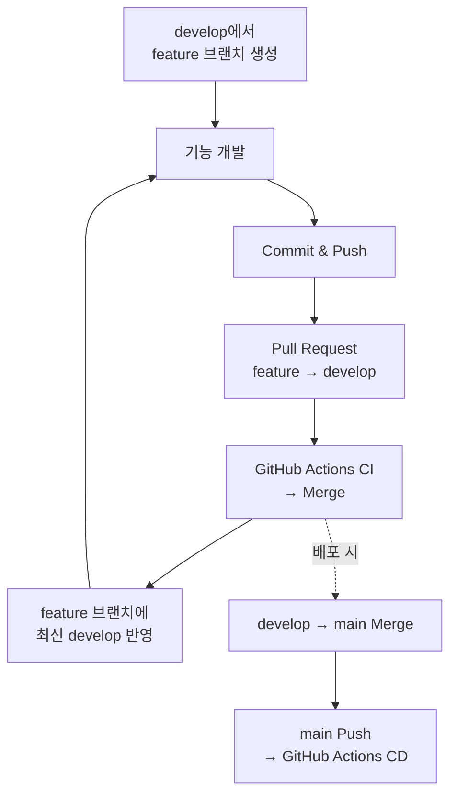

### 👤 코딩 컨벤션

1. **네이밍 규칙**
    - 의미를 명확하게 표현하는 이름을 사용한다.
    - 축약어 사용을 지양하며, 불가피한 경우 팀에서 합의한 약어만 사용한다.
    - 패키지명은 소문자로 작성한다.
    - 클래스와 인터페이스는 PascalCase를 사용한다.
    - 메서드는 camelCase를 사용하며 동사로 시작한다. (단, 접근자와 객체 변환 메서드는 예외)
    - 변수는 camelCase를 사용한다.
    - Boolean 변수는 긍정형으로 작성한다.
    - 조건을 반환하는 메서드는 is, has, can, should 등의 접두어로 시작한다.
    - 이중 부정 형태의 이름은 사용하지 않는다.
    - 상수는 UPPER_SNAKE_CASE를 사용한다.
2. **코드 스타일**
    - 들여쓰기는 Space 4칸을 사용한다.
    - if, for, while 등의 제어문에서 중괄호를 생략하지 않는다.
    - 메서드 선언이나 호출이 길어지는 경우 파라미터를 한 줄에 하나씩 작성한다.
3. **주석 작성 규칙**
    - 코드만으로 의도가 명확한 경우 주석을 작성하지 않는다.
    - 구현 방식보다 작성 이유와 의도를 설명하는 주석을 작성한다.
4. **DTO 작성 규칙**
    - @Setter와 @Data의 사용을 금지한다.
    - DTO는 불변 객체로 작성하는 것을 원칙으로 한다.
    - 단순 데이터 전달 목적의 DTO는 record 사용을 우선한다.
    - 상속이나 가변성이 필요한 경우 class를 사용할 수 있다.
    - 단순 변환만을 위한 별도의 Mapper 클래스는 작성하지 않는다.
    - 객체 변환은 from(), toEntity() 등의 메서드를 통해 명시적으로 수행한다.
5. **의존성 주입 규칙**
    - 의존성 주입은 생성자 주입만 사용한다.
    - 생성자 주입 방식은 @RequiredArgsConstructor로 통일한다.
    - 주입받는 의존성은 final로 선언한다.
6. **Optional / null 사용 규칙**
    - 값이 없음을 표현하기 위해 null을 반환하지 않는다.
    - 단일 값이 없을 수 있는 경우 Optional을 사용하며 없으면 Optional.empty()를 반환한다.
    - Optional을 필드와 메서드 파라미터 타입으로 사용하지 않는다.
    - 컬렉션의 값이 없는 경우 빈 컬렉션을 반환한다.
    - 필수 데이터가 존재하지 않거나 비어 있는 경우에는 명시적인 예외를 발생시킨다.
7. **예외 처리 규칙**
    - 빈 catch 블록을 작성하지 않는다.
    - 비즈니스 예외는 RuntimeException 기반의 커스텀 예외로 정의한다.
    - 커스텀 예외는 에러 코드를 포함한다.
    - GlobalExceptionHandler에서 예외를 공통 오류 응답으로 변환한다.
    - Checked Exception 변환 시 원본 예외(cause)를 반드시 포함한다.
    - HTTP 요청 처리 중 발생한 모든 예외는 GlobalExceptionHandler에서 유형에 맞는 로그 레벨로 한 번만 기록한다.
8. **로그 작성 규칙**
    - 로그 출력에 표준 출력 및 표준 오류 스트림(System.out, System.err)을 사용하지 않는다.
    - SLF4J를 사용하며 아래의 로그 레벨 기준을 준수한다.
        - ERROR: 서비스 장애 또는 즉시 확인이 필요한 오류 (ex: 시스템 에러, DB 다운)
        - WARN: 예상 가능한 예외 또는 주의가 필요한 상황 (ex: 비즈니스 예외, 4xx 에러)
        - INFO: 주요 비즈니스 이벤트 및 상태 변경 (ex: 회원가입 완료, 결제 성공)
        - DEBUG: 개발 및 디버깅에 필요한 상세 정보
    - 로그 메시지는 문자열 결합 대신 파라미터 바인딩({})을 사용한다.
    - 개인정보와 인증정보 등 민감한 정보는 로그에 남기지 않는다.
9. **매직 넘버 및 상수 관리 규칙**
    - 의미를 알기 어려운 숫자나 문자열을 코드에 직접 사용하지 않고 이름 있는 상수로 선언한다.
    - 특정 클래스에서만 사용하는 상수는 외부 클래스로 빼지 않고 해당 클래스 내부에 선언한다.
    - 여러 클래스에서 공유하는 상수는 별도 상수 전용 클래스(Constants)로 분리하여 관리한다.
    - 서로 연관되어 있거나 특정 범주를 가지는 상태/유형 상수는 enum을 사용하여 관리한다.
10. **테스트 코드 작성 규칙**
    - 테스트 메서드명은 @DisplayName 대신 언더바를 활용하여 상황과 결과 의도를 명확히 표현한다. (ex: 존재하지_않는_회원_ID로_조회_시_UserNotFoundException이_발생한다)
    - 테스트 본문은 가독성을 위해 Given-When-Then 패턴(주석 분리)을 준수하여 작성한다.
    - 비즈니스 로직은 단위 테스트 및 애플리케이션 통합 테스트로 우선 검증한다.
    - 주요 비즈니스 흐름은 상황에 맞춰 가능한 만큼 API E2E 테스트로 검증한다.

### 👤 커밋 컨벤션

커밋 메시지는 **Conventional Commits** 규격에 따라 **`<타입>: <제목>`** 형식으로 작성한다.

**커밋 타입**

| 타입 | 설명 | 예시 |
| --- | --- | --- |
| **feat** | 새로운 기능 추가 | feat: 회원가입 API 추가 |
| **fix** | 버그 수정 | fix: NullPointerException 수정 |
| **docs** | 문서 관련 수정 (README, .gitignore 등) | docs: API 명세 업데이트 |
| **test** | 테스트 코드 추가/수정 | test: 회원가입 유효성 테스트 추가 |
| **refactor** | 코드 리팩토링 (기능 변화 없음) | refactor: 중복 코드 제거 |
| **style** | 포맷팅, 세미콜론, 들여쓰기 등 의미 없는 변경 | style: 코드 포매팅 정리 |
| **chore** | 빌드, 의존성, 패키지 관리 등 | chore: Gradle 의존성 버전 업데이트 |
| **infra** | 배포/서버 환경 구성 변경 | infra: Nginx 설정 수정, CI/CD 파이프라인 추가 |

**작성 규칙**

- **대소문자:** 타입은 반드시 소문자로만 작성한다.
- **띄어쓰기:** 콜론(:) 뒤에 반드시 한 칸 띄운다. (O: feat: 회원가입 / X: feat:회원가입)
- **제목 규칙:** 끝에 마침표(.)는 붙이지 않는다.
- **본문 활용:** 설명이 부족한 경우, 제목과 한 줄을 띄운 후 본문을 작성한다.

### 👤 Git branch strategy

- **main**
    - 운영 환경에 배포되는 브랜치
    - `develop` 브랜치의 변경 사항을 Merge하여 배포 버전을 반영한다.
    - `main` 브랜치에 Push되면 GitHub Actions를 통해 운영 환경에 배포(CD)를 수행한다.
- **develop**
    - 개발된 기능을 통합하고 검증하는 브랜치
    - 각 도메인 브랜치의 변경 사항을 Pull Request를 통해 병합한다.
    - Pull Request 단계에서 GitHub Actions를 통해 빌드 및 테스트(CI)를 수행한다.
    - 기능 통합 및 검증이 완료되면 `main` 브랜치에 Merge하여 배포한다.
- **도메인 브랜치**
    - 각 도메인별 기능을 독립적으로 개발하는 브랜치
    - `develop` 브랜치에서 생성한다.
    - 브랜치명은 `feature/{도메인명}` 형식을 사용한다.
    - 기능 또는 작업 단위로 `develop` 브랜치에 Pull Request를 생성한다.
    - Pull Request가 Merge된 후 rebase를 통해 최신 develop 브랜치를 반영하고 작업을 진행한다.

**작업 흐름**

